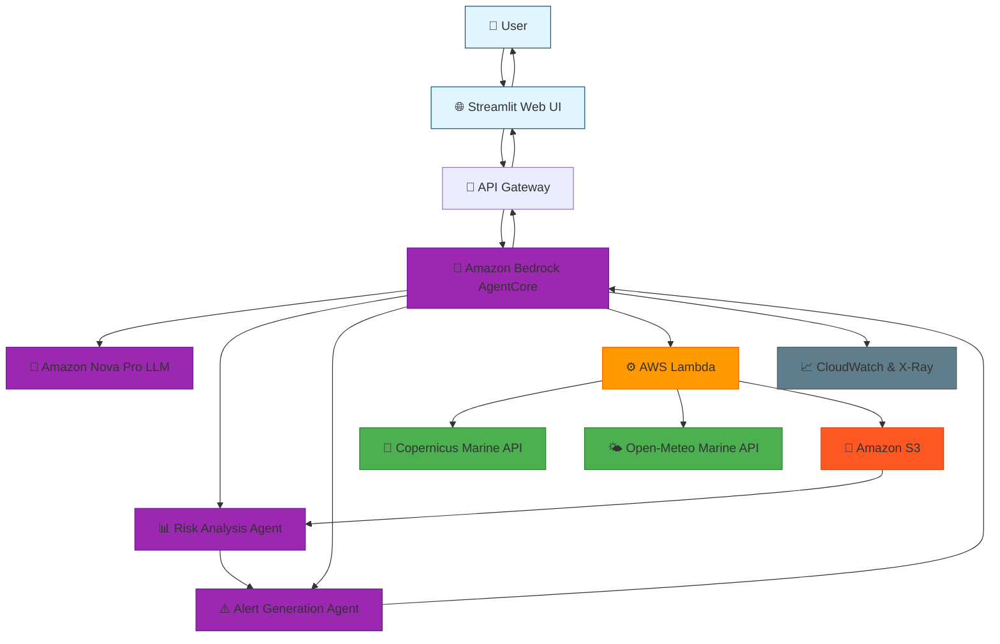

# Simple Architecture Diagram (Fallback for Mermaid compatibility)

**Legend:**
- 🔵 Blue = User Interface Layer
- 🟣 Purple = AI Agent Layer (Bedrock AgentCore)
- 🟠 Orange = AWS Services (Lambda, API Gateway)
- 🔴 Red = Storage (S3)
- 🟢 Green = External APIs
- ⚫ Gray = Observability (CloudWatch/X-Ray)
